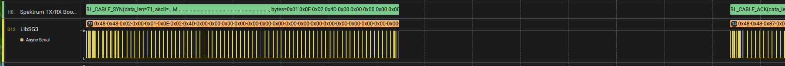
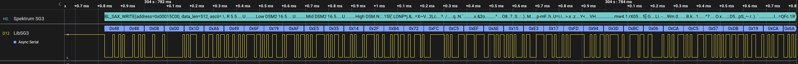
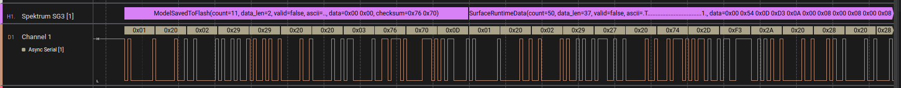
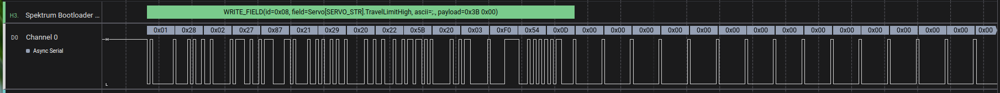
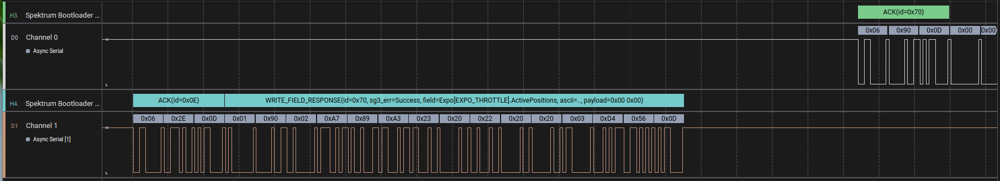
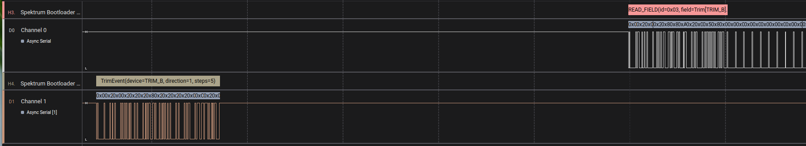
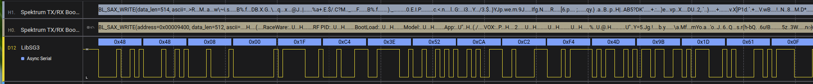
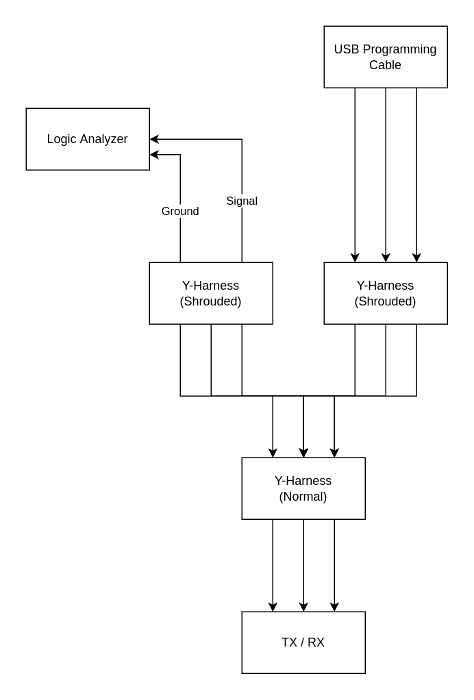
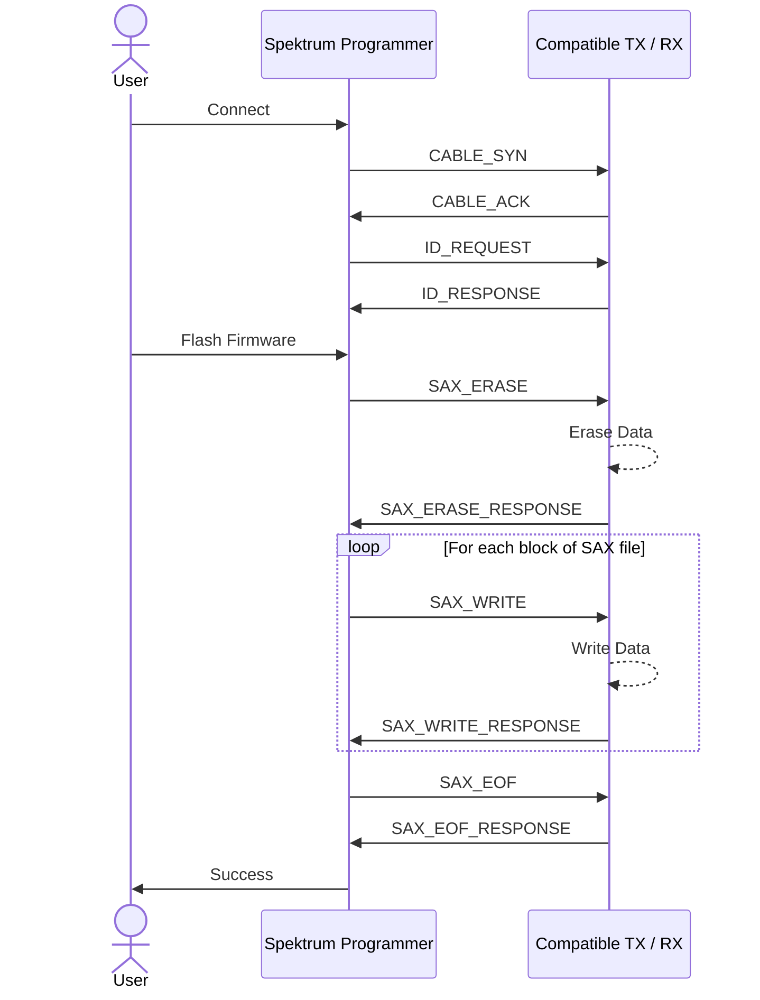
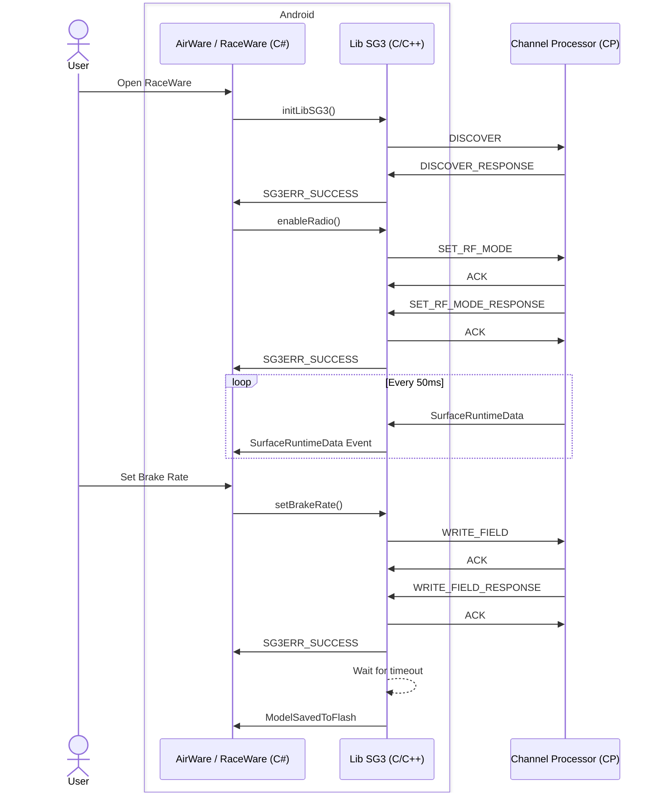

# Spektrum Bootloader and SG3 Decoder
> **Note**: This plugin is still a work-in-progress and may contain bugs
> 
This is a High Level Analyzer for Saleae Logic 2.x software. It supports the decoding of a couple of
Serial communication formats used by Spektrum in their DX and iX series of Surface and Air 
Transmitters and Receivers.

## Features
- Decode bootloader messages between Spektrum Programmer software for Windows and compatible Spektrum Receivers and Transmitters. 
- Decode UART messages between an Android-based Spektrum Radio (DX6R, iX12, iX14, iX20), and it's corresponding Channel Processor (CP).

## Images

### Spektrum Programmer
#### About
Communication is done via serial communication over a single wire.
#### Wiring Setup
- Use a `Spektrum TX/RX USB Programming Cable (SPMA3065)`
- Use a standard `Y-Harness` connector for servo cables. (Example: `SPMA3058`)
- Connect the programming cable to your computer's USB port.
- Connect the servo end of the programming cable to one of the two shrouded connectors on the Y-Harness.
- Connect the servo end of the Y-Harness to your compatible TX/RX.
- Connect your Logic Analyzer's Ground to the Ground pin of the leftover shrouded connector.
- Connect one of your Logic Analyzer's Pins to the Signal pin of that same connector.

#### Logic2 Setup
- Create an `Async Serial` Analyzer with the speed `115200` and rest leave as default.
- Create a new `Spektrum TX/RX Bootloader and SG3 Decoder` Analyzer and link it with the `Async Serial` Analyzer you used in the previous step.
#### Diagrams
Flash new firmware to compatible Spektrum TX or RX using Spektrum Programmer software.

### iX12/14/20 and DX6R LibSG3
#### About
The Android based iX12, iX14, and iX20 Air Transmitters and DX6R Surface Transmitter communicate from the Android application to the 
Channel Processor (CP) using a custom Spektrum C/C++ Library called LibSG3, which uses UART on port `/dev/ttyS0` @ `115200` baud rate.

#### Wiring Setup
- Probe the various Test Points on the PCB for anything sending Serial communication
- On a DX6R, the UART is on `TP35` and `TP36`

#### Logic2 Setup
- Create 2 `Async Serial` Analyzers with the speed `115200` and rest leave as default.
- Create a new `Spektrum TX/RX Bootloader and SG3 Decoder` Analyzer for each `Async Serial` Analyzer you created in the previous step.

#### Diagrams
Example communications of a DX6R radio

